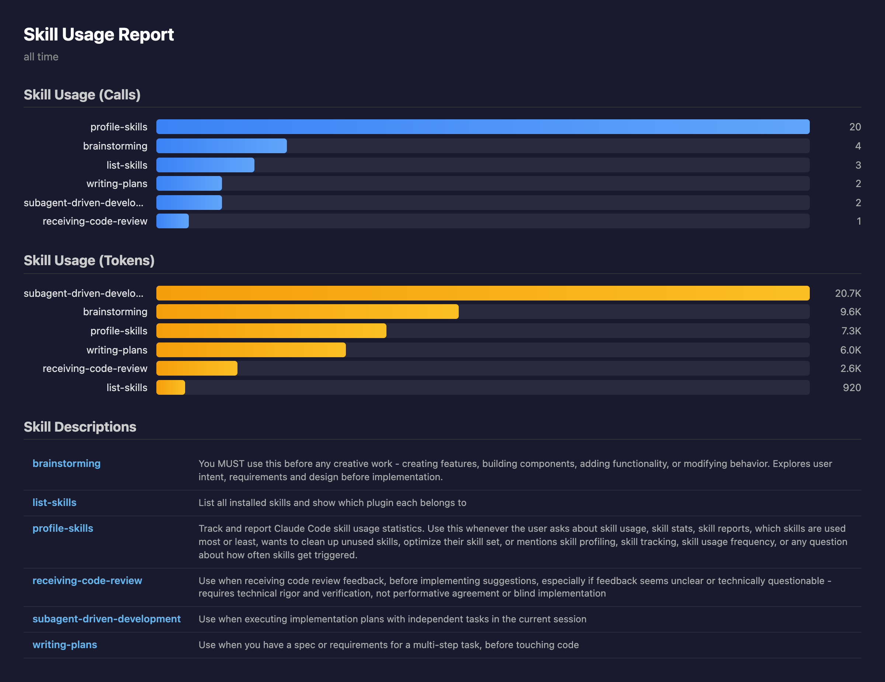

# Skills Cleaner

A Claude Code plugin for profiling and managing installed skills — track usage, visualize statistics, and clean up duplicates.

## Installation

```bash
claude plugin marketplace add amebahead/skills-cleaner
claude plugin install skills-cleaner
```

Or within Claude Code:

```
/plugin marketplace add amebahead/skills-cleaner
/plugin install skills-cleaner
```

## Commands

| Command | Description |
|---------|-------------|
| `/profile-skills` | Track skill usage stats, token consumption, and visual HTML report |
| `/list-skills` | List all installed skills grouped by plugin |
| `/search-skills` | Search for a skill by name and show its path |
| `/clean-skills` | Compare skills for similarity and clean up duplicates |

### /profile-skills

Track and analyze skill usage across sessions. Shows per-skill call counts and token consumption, with automatic normalization of qualified names (`plugin:skill` and `skill` are merged).

**Terminal report:**

```
  Skill Usage Report (all time)

   #  Skill                         Tokens  Calls  AvgTime  Model
   1  subagent-driven-development    10.0K      1    15.3s  opus-4-7
   2  brainstorming                   8.2K      3     8.1s  opus-4-7
   3  receiving-code-review           2.6K      1     4.2s  sonnet-4-6
   4  profile-skills                  1.2K      3     0.5s  opus-4-7

  Total: 22.0K tokens | 8 calls | 4 skills | 43.7s runtime
  Period: 2026-04-13 ~ 2026-04-14
```

**HTML visual report (`--detail`):**

Opens an interactive HTML dashboard in the browser with:
- **Skill Usage (Calls)** — horizontal bar chart sorted by call count
- **Skill Usage (Tokens)** — horizontal bar chart sorted by token consumption
- **Skill Usage (Avg Duration)** — horizontal bar chart of average execution time per call
- **Skill Descriptions** — table labeled as `skill-name (plugin-name)`, grouped by plugin



The HTML is self-contained (no external dependencies) and served on `localhost:8765`.

Options:
- `--period day|week|month|all` — Filter by time period
- `--top N` — Show only top N skills
- `--detail` — Open HTML visualization in browser

### /list-skills

Shows all installed skills grouped by source (personal or plugin name).

```
Installed Skills (16 total)

personal (2 skills)
  my-custom-skill       Custom automation tool
  my-helper             Helper for daily tasks

superpowers (10 skills)
  brainstorming         Explore intent and requirements before implementation
  writing-plans         Create implementation plans from specs
  ...
```

### /search-skills

Find a skill by name and see where it's installed.

```
Search: "debug"  →  2 results

  debugging
    Source:  superpowers (plugin)
    Path:    ~/.claude/plugins/cache/superpowers/skills/systematic-debugging/SKILL.md

  debug-helper
    Source:  personal
    Path:    ~/.claude/skills/debug-helper/SKILL.md
```

### /clean-skills

Compares all installed skills for similarity, generates a report, and interactively guides cleanup.

**4-stage pipeline:**

```
Collect → Parallel Compare → Report → Interactive Removal
```

Report shows only 70%+ similarity pairs:

```
#1  executing-plans  VS  subagent-driven-development
    ██████████████████░░ 85%  ·  plugin VS plugin
```

| Grade | Similarity | Meaning |
|-------|-----------|---------|
| 🔴 | 90%+ | Remove candidate |
| 🟡 | 70-89% | Review suggested |
| 🟢 | <70% | Unique (excluded from report) |

Then presents similar pairs one at a time for interactive removal with a final confirmation gate.

- **Personal skills**: Deletes the skill directory directly
- **Plugin skills**: Never deletes directly — provides guidance on deactivation or removal

## Usage Tracking

This plugin automatically tracks skill usage via three hooks registered in `plugin.json`:

| Hook | Event | Role |
|------|-------|------|
| `track-skill-start.sh` | `PostToolUse` (Skill matcher) | Records pending entry for Claude-initiated skill calls |
| `track-skill-prompt.sh` | `UserPromptSubmit` | Records pending entry for user-initiated `/skill-name` calls |
| `track-skill-stop.sh` | `Stop` | Extracts `output_tokens` + `model` from the transcript and computes `duration_ms` for the final log entry |

Each entry captures token usage, the Claude model used, and the execution time for both Claude-initiated and user-initiated skill calls. Data is logged to `~/.claude/skill-usage.jsonl`:

```jsonl
{"skill":"brainstorming","ts":"2026-04-10T02:19:18Z","session":"abc123","source":"claude","model":"claude-opus-4-7-20251022","duration_ms":12400,"output_tokens":2566}
{"skill":"list-skills","ts":"2026-04-10T03:00:00Z","session":"def456","source":"user","model":"claude-sonnet-4-6-20250929","duration_ms":2100,"output_tokens":1234}
```

## License

MIT
