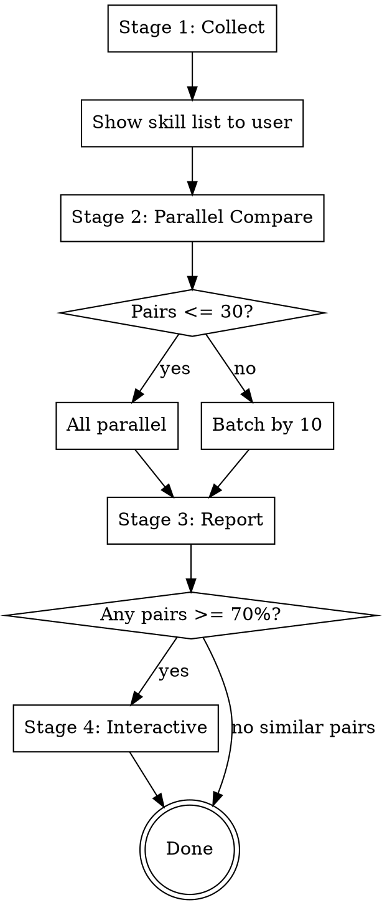

# Skills Cleaner

## Overview

Compare the full SKILL.md content of all installed skills to identify similar/redundant skills, then interactively guide the user through cleanup.

## When to Use

- When asked to clean up or organize skills
- When checking for duplicate or overlapping skills
- After installing new skills to check for conflicts with existing ones

## Process Flow



## Stage 1: Collect Skills

Collect SKILL.md files from two paths:
1. `~/.claude/skills/**/SKILL.md` — personal skills
2. `~/.claude/plugins/cache/**/SKILL.md` — plugin skills

Extract from each: name, description, full body content, file path, source (personal/plugin).

Show the collected list to the user:

```
Found 16 skills:
  [personal]  my-custom-skill    ~/.claude/skills/my-custom-skill/
  [plugin]    brainstorming      ~/.claude/plugins/cache/.../brainstorming/
  ...
```

## Stage 2: Parallel Comparison with Subagents

**You MUST use subagents in parallel.** Do NOT compare sequentially in a single agent.

One skill pair = one subagent. Generate N*(N-1)/2 pairs from N skills.

### Subagent Prompt Template

Pass the following prompt along with the full SKILL.md content of both skills to each subagent:

```
Read the full SKILL.md content of both skills and compare them across these 4 dimensions:

1. Purpose similarity — Do they solve the same problem?
2. Trigger similarity — Are they invoked in the same situations?
3. Process similarity — Do their workflows overlap?
4. Output similarity — Do they produce the same type of result?

Scoring guidelines:
- High similarity requires solving the same problem in the same way
- Skills covering the same topic but with different roles (e.g., requesting vs receiving) are complementary, NOT duplicates
- If one skill borrows principles from another but applies them to a different domain, score LOW
- Skills at different stages of a workflow are NOT duplicates

Respond ONLY in this format:

similarity_percent: (integer 0-100)
overlapping_features:
  - "overlapping feature 1"
  - "overlapping feature 2"
differences:
  - "difference 1"
  - "difference 2"
recommendation: "reason for removal or retention"
```

### Batch Strategy

- 30 pairs or fewer: run all subagents in parallel at once
- More than 30 pairs: run in batches of 10

### Failure Handling

If a subagent fails or returns a malformed response, skip that pair. Show the skip count in the report.

## Stage 3: Report

**Only include pairs at 70% or above.** Never include pairs below 70%.

Sort by similarity descending. Follow this exact format:

```
Skills Similarity Report
Analyzed: 14 skills · 91 pairs · Threshold: 70%

Found 3 similar pairs:

#1  executing-plans ↔ subagent-driven-development
    Similarity: ██████████████████░░ 85%
    Source: plugin ↔ plugin

    Overlapping
      · Both execute implementation plans via subagents
      · Both include a code review stage

    Differences
      · executing-plans: runs in a separate session
      · subagent-driven-development: runs in the current session

    Recommendation
      Choose one based on whether session isolation is needed

---

#2  ...

---

Summary
  🔴  90%+   Remove candidate     0 pairs
  🟡  70-89% Review suggested     3 pairs
  🟢  <70%   Unique              (number of skills not in any similar pair)
```

### Similarity Bar

Visualize the percentage as a 20-character progress bar: `██████████████████░░ 85%`

### Similarity Grades

- 90%+ → 🔴 Remove candidate (nearly identical)
- 70-89% → 🟡 Review suggested (overlapping functionality)
- <70% → Excluded from report

## Stage 4: Interactive Removal Guide

After the report, ask the user:

```
Found N similar pairs. Review them one by one? (y/n)
```

Ask about **one pair at a time** in descending similarity order. Wait for the user's response before showing the next pair. Never show multiple pairs at once.

```
#1  executing-plans ↔ subagent-driven-development (85%)

    What would you like to do?
    a) Remove executing-plans
    b) Remove subagent-driven-development
    c) Keep both (skip)
```

After the user responds:

```
#2  (next pair)...
```

### Auto-Skip Rule

If the user chose to remove skill A, automatically skip any subsequent pairs that include A, and notify the user.

### Final Confirmation Gate

After reviewing all pairs, always confirm before any actual deletion:

```
To be removed: executing-plans, my-redundant-skill
Proceed? (y/n)
```

### Removal Actions

**Personal skills** (`~/.claude/skills/`): delete the skill directory.

**Plugin skills**: NEVER delete directly. Instead, provide guidance:
- How to disable a specific skill in the plugin settings
- How to remove the plugin entirely (`claude plugins remove <name>`)
- Cache files are regenerated on plugin updates — direct modification is not recommended

**NEVER suggest using `rm -rf` to delete plugin cache files.**

### Completion Summary

```
Review complete.

  Removed: 1 skill (executing-plans)
  Kept:    13 skills
  Skipped: 2 pairs
```

## Common Mistakes

| Mistake | Correct Approach |
|---------|-----------------|
| Sequential comparison in a single agent | Always use parallel subagents |
| Including pairs below 70% in the report | Only include 70% and above |
| Suggesting direct deletion of plugin cache | Only guide on deactivation methods |
| Presenting rm commands without interactive flow | Step-by-step questions then final confirmation |
| Missing source (personal/plugin) labels | Always show Source for each pair |
| Skipping final confirmation before deletion | Always require final confirmation gate |
| Showing multiple pairs at once | Ask one pair at a time, wait for response |
| Treating complementary skills as duplicates | Score low when roles differ |
